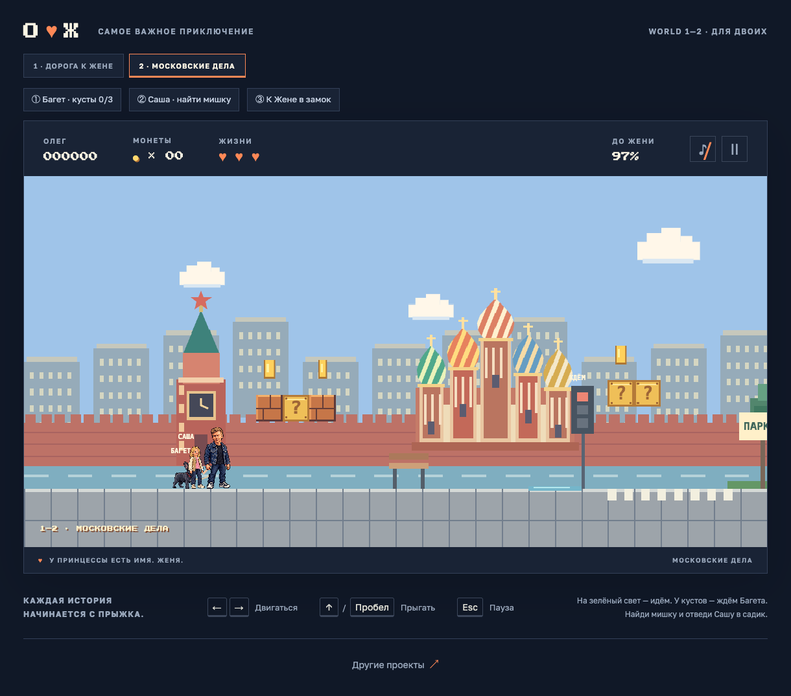

# Люблю Женёчка — Олег и Женя

**[▶ Играть в браузере](https://zhenya.olegluzin.ru/)**



Личная игра-подарок для Жени: история о том, как Олег добирается до неё через два уровня ретро-платформера. Проект создан с помощью Codex; персональные персонажи подготовлены с помощью генерации изображений. На первом уровне — монеты, прыжки и замок. На втором — московская прогулка, Багет и несколько семейных дел по дороге к Жене.

Игра написана на HTML, CSS и JavaScript с отрисовкой в Canvas. Она работает на компьютере и телефоне, без сервера приложения и сборки. Звук синтезируется в браузере и включается отдельной кнопкой. Результаты между запусками не сохраняются.

## Управление

| Действие | Компьютер | Телефон |
| --- | --- | --- |
| Двигаться | ← / → или A / D | Свайп вбок или кнопки ◀ / ▶ |
| Прыгать | ↑, W или пробел | Свайп вверх или «Прыжок» |
| Начать / продолжить | Enter или кнопка на экране | Кнопка на экране |
| Пауза | Esc или Ⅱ | Ⅱ |

Уровни доступны через переключатель над игрой. При последовательном прохождении очки и жизни переходят во второй уровень.

## Локальный запуск

Нужен Python 3. Выполните из корня репозитория:

```sh
python3 -m http.server 5173 --bind 127.0.0.1 --directory dist
```

Откройте <http://127.0.0.1:5173/>. Устанавливать зависимости не требуется. Шрифты загружаются из Google Fonts; без сети браузер использует запасные шрифты. Изображения и игровые звуки доступны локально. Код аналитики запускается только на домене действующей игры, на localhost он не загружается.

## Проверки

Нужен Node.js, дополнительные пакеты не требуются:

```sh
node tests/game.cjs
```

Проверки проходят оба уровня с настоящим перемещением и прыжками; также проверяют столкновения, жизни, награды за флаг, московские задания, контрольные точки, паузу, мобильное управление и интерполяцию отрисовки. Они моделируют браузерное окружение и не заменяют проверку внешнего вида на телефоне.

## Структура

- `dist/` — готовая игра: HTML, CSS, JavaScript и изображения.
- `tests/game.cjs` — проверки игровой механики.
- `docs/gameplay.png` — скриншот второго уровня.
- [ARTWORK.md](ARTWORK.md) — происхождение и список изображений.

## Использование кода и изображений

Код и текстовая документация распространяются по [MIT](LICENSE). Код можно использовать, изменять и распространять, в том числе в коммерческих проектах, с сохранением уведомления о лицензии.

**Персональные спрайты в `dist/assets/` и скриншоты в `docs/` исключены из MIT.** Отдельная лицензия на их переиспользование не предоставляется. Для своего проекта замените их собственными персонажами и изображениями. Открытый доступ к этому репозиторию не предоставляет отдельного разрешения на использование внешности изображённых людей. Подробности — [ASSET_USAGE.md](ASSET_USAGE.md).

## SEO и выпуск

[SEO.md](SEO.md) описывает постоянные метаданные, приватность, автоматические проверки и публикацию на Beget. Каждый пакет выпуска проходит игровые и SEO-проверки; после загрузки проверяется действующий сайт.
